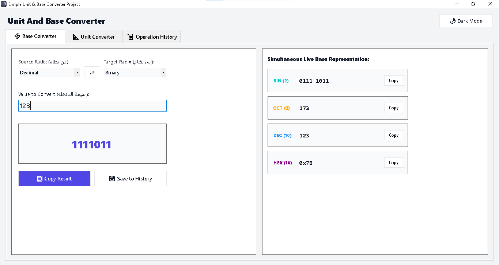
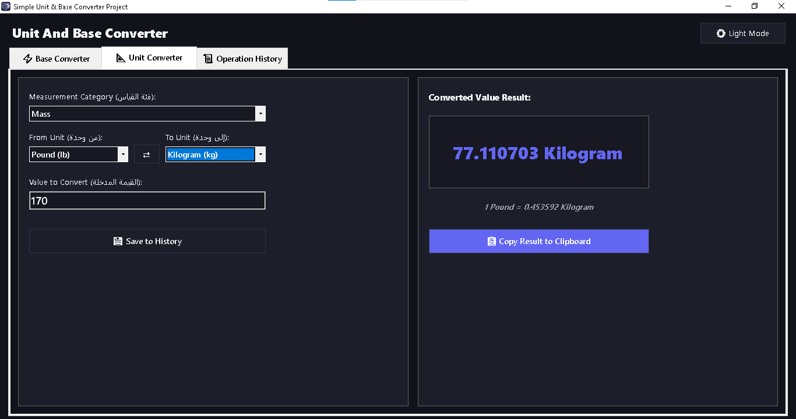
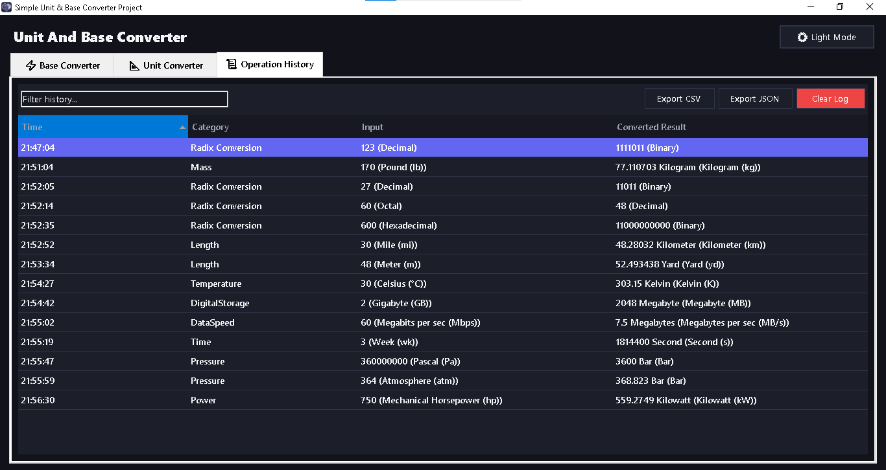

#  Unit & Base Converter Studio

A modern, highly customizable desktop utility application built with **C#** and **Windows Forms (.NET Framework 4.8)** using **Visual Studio 2026**. **Unit & Base Converter Studio** offers real-time radix/number base conversions alongside comprehensive multi-category unit transformations, wrapped in an elegant custom-rendered UI with dark/light themes, history logging, and data export.

---
## 📸 Screenshots

| Light Theme (Base Converter) | Dark Theme (Unit Converter) | History Log & Export |
| :---: | :---: | :---: |
|  |  |  |
---

## ✨ Features

### 🔢 1. Number Base Converter

* **Multi-Base Real-Time Conversion**: Instantly converts numeric inputs between:
* **Binary (Base 2)**: Auto-formats into 4-bit nibbles (e.g., `1010 1101`).
* **Octal (Base 8)**.
* **Decimal (Base 10)**: Auto-formats with comma thousands separators.
* **Hexadecimal (Base 16)**: Auto-prefixed with standard `0x` notation.


* **Live Base Preview**: View synchronized live conversions across all four bases simultaneously with single-click copy buttons and color-coded radix indicators.
* **Strict Input Validation**: Real-time Regex-based input filtering preventing invalid character entry based on the active base.

### 📏 2. Multi-Category Unit Converter

High-precision transformation models supporting **8 distinct measurement categories**:

* **Length**: Meter, Kilometer, Centimeter, Millimeter, Micrometer, Nanometer, Mile, Yard, Foot, Inch, Nautical Mile.
* **Mass**: Kilogram, Gram, Milligram, Metric Ton, Pound, Ounce, Stone, Carat.
* **Temperature**: Celsius (°C), Fahrenheit (°F), Kelvin (K), Rankine (°R).
* **Digital Storage**: Bit, Byte, KB, MB, GB, TB, PB.
* **Data Speed**: bps, Kbps, Mbps, Gbps, B/s, KB/s, MB/s, GB/s.
* **Time**: Nanosecond, Microsecond, Millisecond, Second, Minute, Hour, Day, Week, Year.
* **Pressure**: Pascal, Kilopascal, Bar, PSI, Atmosphere, Torr/mmHg.
* **Power**: Watt, Kilowatt, Megawatt, Mechanical HP, Metric HP, BTU/hr.

### 📜 3. History Management & Export

* **Auto-Logging**: Captures up to 500 recent conversion operations with exact timestamps.
* **Real-Time Filtering**: Search history records by conversion category, input values, or measurement units.
* **Data Export**: Export conversion logs to **CSV** or **JSON** files with custom save dialogs.

### 🎨 4. Modern UX & Custom GDI+ Rendering

* **Dynamic Theme Engine**: Smooth one-click toggle switching between Dark Charcoal and Light themes.
* **Custom UI Controls**: GDI+ custom-rendered rounded cards, custom buttons, segmented tabs, and toast notifications for copy/export actions.

---

## 🛠️ Built With

* **Programming Language**: C #
* **Framework**: .NET Framework 4.8
* **UI Platform**: Windows Forms (WinForms)
* **IDE**: Visual Studio 2026
* **Graphics Engine**: System.Drawing (Custom GDI+ Rendering)

---

## 📂 Project Structure

```text
simple-unit-and-base-converter-project/
├── docs/
│   └── screenshots/
│       ├── light-mode.png
│       ├── dark-mode.png
│       └── history-and-log.png
├── Properties/
└── Core/
│   ├── BaseConverter.cs
│   ├── UnitConverter.cs
│   ├── HistoryManager.cs
│   ├── ConversionRecord.cs
│   └── Enums.cs
├── UI/
│   ├── Controls/
│   │   └── ModernControls.cs
│   └── Theme/
│       └── ThemeManager.cs
├── App.config
├── AppIcon.ico
├── Form1.cs
├── Form1.Designer.cs
├── Form1.resx
├── Program.cs
├── README.md
├── Simple Unit & Base Converter Project.csproj
├── Simple Unit & Base Converter Project.slnx
└── .gitignore

```

---

## 🚀 Getting Started

### Prerequisites

To build and run this application, make sure you have:

* [Visual Studio 2022 / 2026 or newer](https://visualstudio.microsoft.com/?utm_source=gemini) with **.NET desktop development** workload installed.
* **.NET Framework 4.8 Runtime**.

### Installation & Execution

1. **Clone the repository**:
```bash
git clone https://github.com/Abdullah-Shalgam/simple-unit-and-base-converter-project.git

```


2. **Open the project**:
* Double-click `Simple Unit & Base Converter Project.slnx` (or `.csproj`) to launch Visual Studio.


3. **Build & Run**:
* Press `F5` or click **Start** in Visual Studio.


---

## 📬 Contact & Developer Info

[](https://github.com/Abdullah-Shalgam)
[](https://www.linkedin.com/in/%D8%B9%D8%A8%D8%AF%D8%A7%D9%84%D9%84%D9%87-%D8%B4%D9%84%D8%BA%D9%88%D9%85-289506438)
[](https://instagram.com/abdullah_shalgam)
[](https://wa.me/2180931364346)
[](mailto:bdallhshlghwm500@gmail.com)

---

## 📝 License

Distributed under the MIT License. See `LICENSE` for more information.